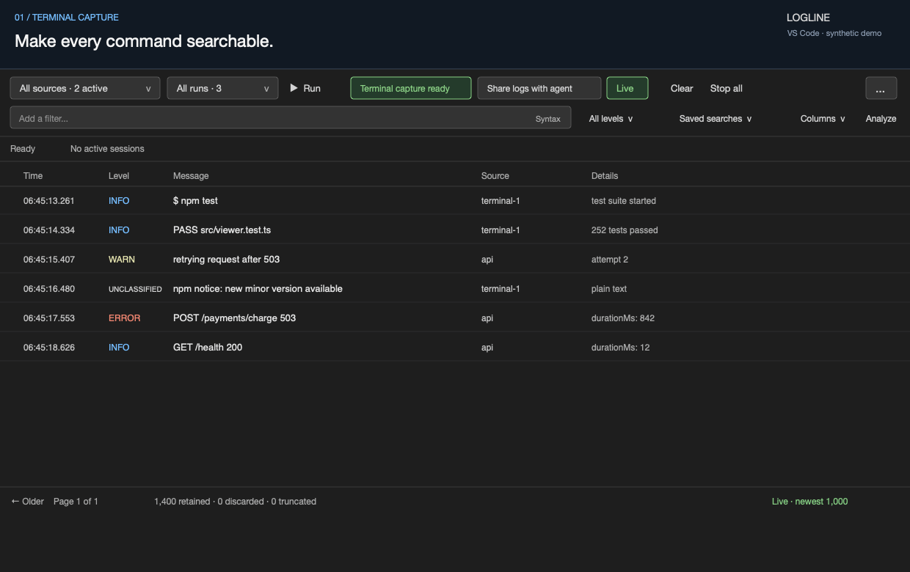

# Logline

**Live tail for JSON logs, right inside VS Code.** Run your server, filter the noise, and inspect an error without leaving the editor. Logline turns structured logs into a searchable table in the bottom **Logs** panel and keeps plain-text output alongside them.

Logline can also capture commands you run in supported VS Code terminals. Enable **Enable terminal capture** once in the Logs panel, run commands normally, and their output becomes searchable without wrapping the command. Choose **Share logs with agent** to make retained Logline sources and new runs in this VS Code window available to Copilot. The first use asks for confirmation and explains that redaction may not remove every sensitive value; later uses enable sharing immediately. The toolbar shows **Sharing logs · Stop**, with the sharing scope below it. Continue in your existing Copilot agent chat and ask it to check the logs. Use **More actions → Choose specific runs to share…** to limit access, or click **Stop** on the sharing button to revoke it. Sharing is held in memory and ends when logs are cleared or the window or workspace changes.



*The actual Logline viewer using [synthetic sample logs](samples/demo-logs.jsonl).*

## Get started

1. Open your project in **VS Code 1.99+** with Logline installed. Logline requires a trusted workspace and does not support virtual workspaces.
2. Open the Command Palette (`Cmd+Shift+P` on macOS, `Ctrl+Shift+P` on Windows/Linux) and run **Logline: Run Command**.
3. Enter your server command, such as `npm run dev`. Its stdout and stderr appear in the **Logs** panel.
4. Type `level:error` in the search box and press **Enter**. Click an event's message to inspect it; choose **Resume** to follow live output again.

**Try it with a file:** run **Logline: Import Logs** and select [samples/demo-logs.jsonl](samples/demo-logs.jsonl) from this repository. You can also import JSON, JSONL/NDJSON, CSV, and plain-text logs.

Open **Help** in the toolbar for the offline visual guide, or run **Logline: What’s New** for release highlights. See [Development](#development) to build and install from source.

## What you can do

| Workflow | Features |
| --- | --- |
| **Capture** | Capture supported terminal commands, run several servers at once, save commands with **Manage servers**, filter by source or run, and capture VS Code tasks. |
| **Search** | Field/value autocomplete, editable filter chips, right-click **Include value** / **Exclude value**, any combination of log levels, and up to 50 saved searches. |
| **Inspect** | Expand JSON, read structured exceptions and nested causes, open stack-frame source locations, share an event’s exact run, and view up to 25 surrounding events on each side from the same run. |
| **Arrange** | Auto-detected fields, custom and nested columns, sorting, drag-to-reorder, and resizable column widths. |
| **Analyze** | Event rate, errors, latency, status codes, the top 10 log patterns, and normalized error groups for the current filter. |
| **Share** | Export filtered JSONL, JSON, CSV, or Markdown context for AI tools, or share retained sources (including new runs) or specific command runs with Copilot for read-only live investigation. Exports and **Copy results** redact common credentials by default; agent tools always redact them. |

**Live** follows the newest events. Turn it off to browse retained history in pages of up to 1,000 rows. Expanding an event holds your place while collection continues; changing filters, sorting, paging, or columns returns inspection to **Browse**. Choose **Live** or **Resume** to return to the newest rows.

**New in 1.8.0:** terminal capture, source/run filters, an Unclassified level for plain text, and explicit redacted Copilot sharing with revocable read-only tools. See the [changelog](CHANGELOG.md) for the full release history.

## Find the logs you need

Type a term and press **Enter** to apply it. Click a chip to edit it, or its **×** to remove it. Terms combine with AND unless you use `OR`.

| Find | Query |
| --- | --- |
| Errors from one service | `level:error service:api` |
| An exact phrase, excluding a service | `"database timeout" -service:web` |
| Either of two services | `service:web OR service:api` |
| HTTP server errors | `status:5xx` or `status:[500 TO 599]` |
| Slow requests | `durationMs:>200` |
| Events with a request ID | `exists:requestId` |
| Messages matching a regex | `message:/time.?out/i` |
| Recent events | `last:15m` |
| An absolute time range | `timestamp:[2026-09-14 TO 2026-09-15]` |

Right-click a cell to include or exclude its value without typing a query. Keyboard users can focus a cell and press **Shift+F10**. Server and level selections stay active.

Common aliases work across log formats, including `level`/`severity`, `message`/`msg`, `status`/`statusCode`, and `durationMs`/`duration`. Plain-text terminal lines without an explicit leading severity are **Unclassified**. Logline recognizes Log4j2 JSON with MDC fields, ECS, Pino HTTP, and individual OpenTelemetry log records. Click **Syntax** in the search box for a quick reference.

## Save a server or capture a task

Use **Manage servers** to save a command, or add it to your workspace settings:

```json
{
  "logline.servers": [
    {
      "id": "api",
      "label": "API",
      "command": "npm run dev",
      "cwd": "${workspaceFolder}",
      "autoStart": false,
      "jsonOnly": false
    }
  ]
}
```

Set `autoStart` to `true` to start when Logline activates. Set `jsonOnly` to `true` to discard non-JSON output, such as build-tool chatter. Each saved server can also specify environment variables through `env`.

**Already using VS Code tasks?** Run **Logline: Convert VS Code Task to Logline** to create a captured wrapper, including supported dependencies. Logline observes ordinary task lifecycle events automatically; retaining their stdout/stderr requires a captured wrapper. You can also define a task with `"type": "logline"` directly—see [task configuration](docs/usage.md#tasks).

**Working with Copilot?** Share all retained Logline sources, choose specific runs, or share the exact run behind an expanded event. Sharing grants read-only access to redacted results in the current VS Code window; it does not execute commands or send logs into chat automatically. Ask Copilot to use the Logline tools, or run **Logline: Ask Copilot to Investigate Logs** for an editable handoff prompt.

## Settings and retention

Open **Settings** in the toolbar for all options. A few useful defaults:

| Setting | Default | Purpose |
| --- | --- | --- |
| `logline.source` | `both` | Capture stdout, stderr, or both. |
| `logline.captureTerminals` | `false` | Capture new commands from supported VS Code terminals. |
| `logline.columns` | `[]` | Auto-detect columns, or specify preferred fields. |
| `logline.timezone` | `local` | Show local or UTC timestamps. |
| `logline.maxEvents` | `50000` | Maximum retained events. |
| `logline.maxMemoryMb` | `100` | Estimated event-storage budget in MiB. |
| `logline.persistLogs` | `false` | Write original logs to `.logline/latest.log`. |
| `logline.redactExports` | `true` | Redact exports and **Copy results**. Agent sharing is always redacted. |

Older events are discarded when either retention limit is reached. Search, context, and analysis cover retained events only; the memory budget estimates event storage, not total VS Code memory. Add `.logline/` to `.gitignore` if you enable persistence.

**Copy event** and disk persistence keep original content. **Copy results** and AI Markdown exports include the latest 1,000 matching events; full JSON/JSONL/CSV exports cover all matches in the retained snapshot. Use CSV when you want to export and re-import the original raw records—JSON/JSONL exports contain Logline event envelopes.

See the [usage reference](docs/usage.md) for all settings, query details, import/export behavior, task examples, and retention limits.

## Development

```sh
npm ci
npm run check       # compile, type-check host and webview, and run tests
npm run watch       # rebuild host and browser sources as you edit
npm run package     # build an installable .vsix
```

Press **F5** to launch an Extension Development Host. To install a packaged build, run **Extensions: Install from VSIX…** in VS Code and select the generated `.vsix` file.

Host code lives in `src/` and compiles to `out/`. The webview entry point is `src/webview/main.ts`; `npm run compile` generates `media/viewer.js`. Run `npm run smoke` for the isolated VS Code activation/task smoke test, or `npm run benchmark` for diagnostic performance measurements.

- [Architecture](ARCHITECTURE.md): modules, state ownership, and testing.
- [Usage reference](docs/usage.md): detailed feature behavior and configuration.
- [Changelog](CHANGELOG.md): complete release history.

When releasing, update `CHANGELOG.md`, the affected cards in `media/guide.html`, user-facing highlights in `src/vscode/guide-content.ts`, and `media/demo.gif`. Keep highlight section IDs aligned with the guide, then run `npm run check` and `npm run package`.

## License

[MIT](LICENSE)
