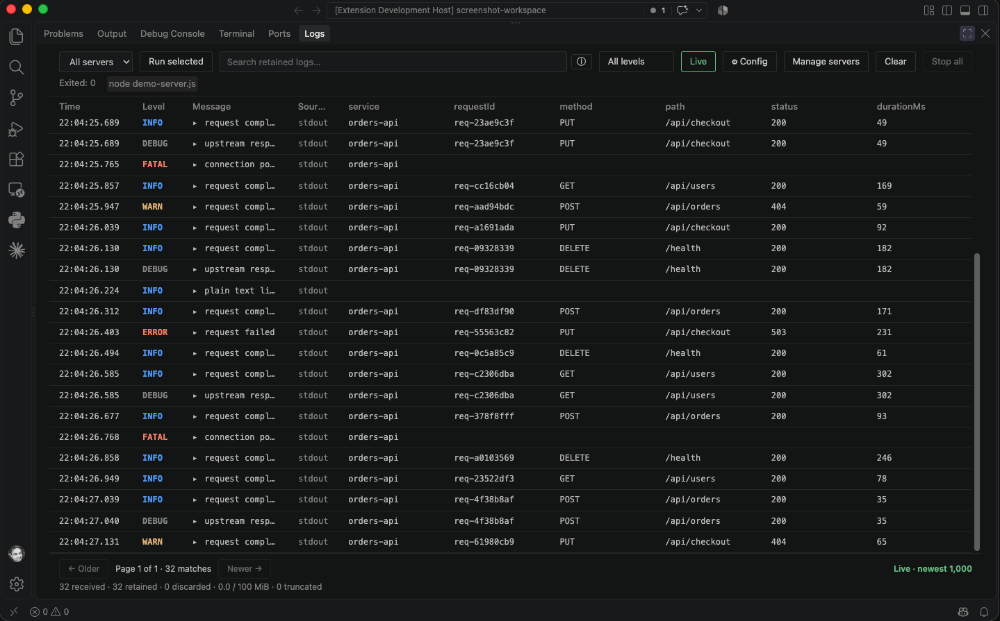

# Logline

**Live tail for JSON logs.** Logline is a VS Code bottom-panel log viewer for long-running server processes. It parses JSON logs, preserves plain-text output, and provides expandable details, searchable fields, level filters, timestamps, and per-server filtering.



## Use

Run **Logline: Run Command**, or open **Manage servers** in the Logs panel to add, edit, and delete saved commands. Multiple servers can run concurrently; the dropdown separates them by server ID. **Stop server** stops the selected process; **Stop all** stops every process. Running a command requires a trusted workspace.

A saved server can also start automatically when the extension activates by setting `autoStart: true` on it (also requires a trusted workspace). Set `jsonOnly: true` on a server whose command interleaves build-tool output with its own JSON logs (for example `gradle bootRun`) to discard everything that isn't valid JSON.

**Live** follows the newest events. Turn it off to browse retained history with Older/Newer. The panel renders up to **1,000 rows per page**.

The server selector shows each server's current session state and active-session count. Use **Export** to save the current server, search, and level filters as redacted JSON Lines, JSON, CSV, or **AI context (Markdown)**. The AI context option includes the latest 2,000 matching events in a redacted Markdown file. **Import** loads JSON/JSONL files into an `Imported` server entry for offline searching.

The level filter (next to the search box) is a multi-select — check any combination of Trace/Debug/Info/Warn/Error/Fatal, not just "this level and above." Click **Syntax** in the search box for a cheat sheet of the query syntax below.

Search supports Datadog-style queries:

- Field filters — `level:error`, `service:api`
- Quoted phrases, negation, and OR — `"database timeout" -service:web`, `service:web OR service:api`
- Wildcards and exact match — `status:5xx`, `status:503`
- Comparisons and ranges — `duration:>200`, `status:[500 TO 599]`
- Field presence — `exists:requestId`
- Regex — `message:/timeout/i`
- Relative or absolute time — `last:15m`, `timestamp:[2026-01-01 TO 2026-01-02]`

A term only becomes a field filter when a bare identifier precedes the colon, so pasted values that contain colons — URLs, `host:port` pairs, clock times — are searched as free text.

Field names match as typed and fall back to common aliases, so `statusCode:200` and `status:200` both work whether the log calls the field `status` or `statusCode`. The same holds for `level`/`severity`, `message`/`msg`, `service`/`service_name`, `requestId`/`request_id`, `traceId`/`trace_id`, and `durationMs`/`duration`.

Log4j2 JsonLayout output is supported directly: the `timeMillis` field is read as the event timestamp, and MDC values nested under `contextMap` are flattened so they're searchable like any other field.

The timezone setting supports Local and UTC.

The search row has separate **Saved searches**, **Filter by value**, **Columns**, and **Analyze** controls. **Saved searches** lets you save named searches and shows the 10 most recent entries from the last 30 retained searches, with a **Clear** action to drop that history. While typing, field names and common values are suggested; **Filter by value** shows counts for a field and lets you search a selected value.

Click a column's name to sort by that field and click it again to reverse the direction; the arrow shows the active direction. Drag its grip to rearrange columns, or drag the divider at its right edge to resize. Payload fields also have an `×` remove control, and **Columns** restores them. Column widths and order are saved per webview.

**Analyze** opens retained metrics for the current filter: event rate, errors, latency, status-code counts, the top 10 log patterns by volume, and normalized error groups. Analysis uses only events currently retained in memory.

### Exceptions and surrounding context

Expand an event to read structured exceptions as stack frames with real line breaks and nested causes. Common `err`, `error`, `exception`, `thrown`, and stack fields are supported, including Log4j2 throwable frames and OpenTelemetry exception fields. Click a stack frame to open its source location in the workspace; ambiguous filenames open a file picker. **Original event** keeps the JSON available, and **Copy event** copies the original formatted event. Plain-text exception lines can link to source, but separate physical lines are not automatically grouped.

Choose **Show context** on an expanded event to see up to 25 retained events before and after it, in capture order, from the same server session. Context includes all levels and both captured streams, regardless of the current search. Select any surrounding event to inspect its details. **Back to results** (or Escape) returns to the existing search and scroll position. Context is a fixed snapshot; ingestion continues, and discarded events cannot be recovered. Each newly imported file has its own context boundary.

## Tasks

Logline observes VS Code task lifecycle events automatically. Shell, process, `node-terminal`, and tasks launched through `launch.json` appear in the Logs selector with their task name, dependency information, process id, and exit reason. VS Code does not expose a supported output stream for an arbitrary task, so use **Logline: Convert VS Code Task to Logline** (or **Logline: Capture VS Code Task in Logline**) to create a captured wrapper when the task's stdout/stderr should be retained line by line. The converter follows `dependsOn` links and creates wrappers for supported dependencies too.

Servers can also be started as a VS Code task, with output streamed into the same Logs panel. Add a task of type `logline` to `.vscode/tasks.json` — comments and trailing commas are fine, it's read as JSONC:

```json
{
  "version": "2.0.0",
  "tasks": [
    {
      "type": "logline",
      "label": "Run API",
      "command": "npm",
      "args": ["run", "dev"],
      "jsonOnly": false,
      // "shell": false,
      // "dependsOn": ["Logline: Build"],
      // "dependsOrder": "sequence",
      // "options": { "cwd": "${workspaceFolder}/server", "env": {} }
    }
  ]
}
```

`args` are passed to the process as literal arguments, so one containing spaces or quotes is safe — it won't be reinterpreted by a shell.

Set `shell: true` when the command is a shell line containing pipes, redirects, or shell operators. Task variables such as `${env:NAME}`, `${config:logline.source}`, and `${input:name}` are resolved by VS Code immediately before the Logline task starts, including variables in `command`, `args`, `options.cwd`, and `options.env`. `jsonOnly: true` applies to this task only and drops non-JSON lines while retaining structured output.

## Configuration

| Setting | Default | Description |
| --- | --- | --- |
| `logline.servers` | `[]` | Saved server commands shown in the server selector. Each entry supports `cwd` (which expands `${workspaceFolder}`), `env`, `autoStart`, and `jsonOnly`. |
| `logline.source` | `both` | Capture `stdout`, `stderr`, or `both`. |
| `logline.columns` | `[]` | Preferred table columns. Empty auto-detects common fields. |
| `logline.timezone` | `local` | `local` or `utc` for displayed timestamps. |
| `logline.indentation` | `2` | Spaces used when formatting expanded JSON. |
| `logline.maxEvents` | `50000` | Maximum events retained in memory. Applied immediately. |
| `logline.maxMemoryMb` | `100` | Approximate memory budget for retained events. Applied immediately. |
| `logline.maxLineLength` | `65536` | Maximum characters retained from one unfinished log line. |
| `logline.refreshIntervalMs` | `500` | Minimum time between Logs panel updates. The panel refreshes as soon as new data arrives rather than on a fixed poll, so this only caps how often that happens during a heavy burst of log lines. |
| `logline.persistLogs` | `false` | Persist captured logs to `.logline/latest.log` in the first workspace folder. |
| `logline.maxDiskMb` | `1000` | Size at which `latest.log` rolls over to `latest.log.1`. Only the current and one previous file are kept. |
| `logline.redactExports` | `true` | Redact common credentials and secret-like fields in exports. |
| `logline.redactionFields` | `[]` | Additional field names to redact in exports. |
| `logline.redactionReplacement` | `[REDACTED]` | Replacement text used for redacted values. |

## Bounded retention

The viewer retains up to **50,000 events or 100 MiB** of estimated event storage by default, whichever limit is reached first. Older events are evicted automatically, and the footer shows the live figure against the configured budget. Raising or lowering `maxEvents` or `maxMemoryMb` takes effect immediately, without reloading the window.

Search, facets, and analysis cover retained history only; enable `persistLogs` or use a log service for archival storage. Persisted logs are written to `.logline/` in the first workspace folder — add that directory to your `.gitignore`.

## Development

This directory contains the extension core, written in TypeScript (`src/`, compiled to `out/`). The webview UI (`media/viewer.js`) is plain JS. Manual testing uses a pair of demo servers — a Node server that emits mixed JSON and plain-text events, and a Spring Boot app — kept outside this repository and not part of the published package.

`samples/demo-logs.jsonl` is a synthetic JSON Lines fixture (not part of the published package) for exercising the viewer without a live server: **Logline: Import Logs** it to get a realistic mix of services, levels, HTTP fields, linked trace/span ids, and two recurring, distinct error call sites, useful for screenshots or trying search, sort, facets, and Analyze.

```sh
npm install
npm run check     # type-check, compile, and run the test suite
npm run watch     # recompile on change
npm run package
```

Press F5 to launch an Extension Development Host (this compiles first). Commands run from the selected working directory using a shell. Stop signals the process group on macOS/Linux and the whole process tree on Windows, escalating to a forced kill after two seconds.

## Workspace trust

The extension runs server commands defined in workspace settings and tasks, so it is disabled in restricted mode and in virtual workspaces. Trust the workspace to use it.
